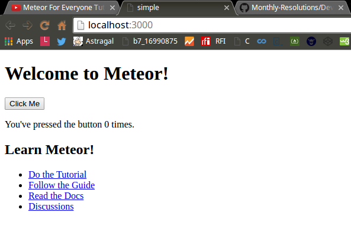
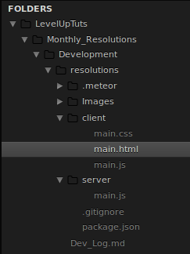

#Level Up Tuts:  
##Meteor For Everyone Tutorial  
###Meteor For Everyone Tutorial #1 - Installing Meteor & Creating a Project  

####console output

```Console  
highslater@mint64 ~/Programming/Meteor/LevelUpTuts/Monthly_Resolutions $ meteor create resolutions
Created a new Meteor app in 'resolutions'.    

To run your new app:                          
  cd resolutions                              
  meteor                                      
                                              
If you are new to Meteor, try some of the learning resources here:
  https://www.meteor.com/learn                

                                              
highslater@mint64 ~/Programming/Meteor/LevelUpTuts/Monthly_Resolutions $ cd resolutions
highslater@mint64 ~/Programming/Meteor/LevelUpTuts/Monthly_Resolutions/resolutions $ ls -hal  

total 28K
drwxr-xr-x 5 highslater highslater 4.0K Apr 22 14:35 .
drwxr-xr-x 5 highslater highslater 4.0K Apr 22 14:35 ..
drwxr-xr-x 2 highslater highslater 4.0K Apr 22 14:35 client
-rw-r--r-- 1 highslater highslater   13 Apr 22 14:35 .gitignore
drwxr-xr-x 3 highslater highslater 4.0K Apr 22 14:35 .meteor
-rw-r--r-- 1 highslater highslater  152 Apr 22 14:35 package.json
drwxr-xr-x 2 highslater highslater 4.0K Apr 22 14:35 server

highslater@mint64 ~/Programming/Meteor/LevelUpTuts/Monthly_Resolutions/resolutions $ meteor
[[[[[ ~/Programming/Meteor/LevelUpTuts/Monthly_Resolutions/resolutions ]]]]]

=> Started proxy.                             
=> Started MongoDB.                           
=> Started your app.                          

=> App running at: http://localhost:3000/

```

#####Web Page Created:  




####client/main.html  

```HTML
<head>
  <title>simple</title>
</head>

<body>
  <h1>Welcome to Meteor!</h1>

  {{> hello}}
  {{> info}}
</body>

<template name="hello">
  <button>Click Me</button>
  <p>You've pressed the button {{counter}} times.</p>
</template>

<template name="info">
  <h2>Learn Meteor!</h2>
  <ul>
    <li><a href="https://www.meteor.com/try">Do the Tutorial</a></li>
    <li><a href="http://guide.meteor.com">Follow the Guide</a></li>
    <li><a href="https://docs.meteor.com">Read the Docs</a></li>
    <li><a href="https://forums.meteor.com">Discussions</a></li>
  </ul>
</template>

```


####client/main.js  

```JavaScript

import { Template } from 'meteor/templating';
import { ReactiveVar } from 'meteor/reactive-var';

import './main.html';

Template.hello.onCreated(function helloOnCreated() {
  // counter starts at 0
  this.counter = new ReactiveVar(0);
});

Template.hello.helpers({
  counter() {
    return Template.instance().counter.get();
  },
});

Template.hello.events({
  'click button'(event, instance) {
    // increment the counter when button is clicked
    instance.counter.set(instance.counter.get() + 1);
  },
});

```

####server/main.js  

```JavaScript  
import { Meteor } from 'meteor/meteor';

Meteor.startup(() => {
  // code to run on server at startup
});


```

###Meteor For Everyone Tutorial #2 - Default Meteor Files  

