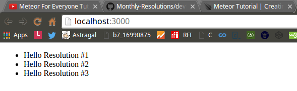

<!-- devLog -->
###Meteor For Everyone Tutorial #1 - Installing Meteor & Creating a Project:  


####Console Output:
```Console  
@mint64 ~/Monthly_Resolutions/resolutions_Original 
$ meteor create resolutions

Created a new Meteor app in 'resolutions'.    

To run your new app:                          
  cd resolutions                              
  meteor                                      
                                              
If you are new to Meteor, try some of the learning resources here:
  https://www.meteor.com/learn                
                                              
@mint64 ~/Monthly_Resolutions/resolutions_Original 
$ cd resolutions

@mint64 ~/Monthly_Resolutions/resolutions_Original/resolutions 
$ ls -hal

total 28K
drwxr-xr-x 5 highslater highslater 4.0K Apr 23 21:50 .
drwxr-xr-x 4 highslater highslater 4.0K Apr 23 21:50 ..
drwxr-xr-x 2 highslater highslater 4.0K Apr 23 21:50 client
-rw-r--r-- 1 highslater highslater   13 Apr 23 21:50 .gitignore
drwxr-xr-x 3 highslater highslater 4.0K Apr 23 21:50 .meteor
-rw-r--r-- 1 highslater highslater  152 Apr 23 21:50 package.json
drwxr-xr-x 2 highslater highslater 4.0K Apr 23 21:50 server
@mint64 ~/Monthly_Resolutions/resolutions_Original/resolutions 
$ meteor

=> Started proxy.                             
=> Started MongoDB.                           
=> Started your app.                          

=> App running at: http://localhost:3000/

```


####client/main.html  

```HTML  
<head>
  <title>simple</title>
</head>

<body>
  <h1>Welcome to Meteor!</h1>

  {{> hello}}
  {{> info}}
</body>

<template name="hello">
  <button>Click Me</button>
  <p>You've pressed the button {{counter}} times.</p>
</template>

<template name="info">
  <h2>Learn Meteor!</h2>
  <ul>
    <li><a href="https://www.meteor.com/try">Do the Tutorial</a></li>
    <li><a href="http://guide.meteor.com">Follow the Guide</a></li>
    <li><a href="https://docs.meteor.com">Read the Docs</a></li>
    <li><a href="https://forums.meteor.com">Discussions</a></li>
  </ul>
</template>
```

####client/main.js  

```JavaScript
import { Template } from 'meteor/templating';
import { ReactiveVar } from 'meteor/reactive-var';

import './main.html';

Template.hello.onCreated(function helloOnCreated() {
  // counter starts at 0
  this.counter = new ReactiveVar(0);
});

Template.hello.helpers({
  counter() {
    return Template.instance().counter.get();
  },
});

Template.hello.events({
  'click button'(event, instance) {
    // increment the counter when button is clicked
    instance.counter.set(instance.counter.get() + 1);
  },
});

```  

####server/main.js  

```JavaScript

import { Meteor } from 'meteor/meteor';

Meteor.startup(() => {
  // code to run on server at startup
});

```


####Web Output:  


###Change File Structure:

####From:

  

####To:  

 

###And Change Files to:  

####resolutions.html  

```HTML

<head>
  <title>simple</title>
</head>

<body>
  <h1>Welcome to Meteor!</h1>

  {{> hello}}
  {{> info}}
</body>

<template name="hello">
  <button>Click Me</button>
  <p>You've pressed the button {{counter}} times.</p>
</template>

<template name="info">
  <h2>Learn Meteor!</h2>
  <ul>
    <li><a href="https://www.meteor.com/try">Do the Tutorial</a></li>
    <li><a href="http://guide.meteor.com">Follow the Guide</a></li>
    <li><a href="https://docs.meteor.com">Read the Docs</a></li>
    <li><a href="https://forums.meteor.com">Discussions</a></li>
  </ul>
</template>

```

####resolutions.js  

```JavaScript

if (Meteor.isClient) {
  Template.hello.onCreated(function helloOnCreated() {
    // counter starts at 0
    this.counter = new ReactiveVar(0);
  });

  Template.hello.helpers({
    counter() {
      return Template.instance().counter.get();
    },
  });

  Template.hello.events({
    'click button'(event, instance) {
      // increment the counter when button is clicked
      instance.counter.set(instance.counter.get() + 1);
    },
  });
  }

if (Meteor.isServer) {
  Meteor.startup(() => {
    // code to run on server at startup
  });
}

```

###Meteor For Everyone Tutorial #3 - Views & Templates In Meteor:  

######resolutions.html  

```HTML  

<head>
  <title>simple</title>
</head>

<body>
<ul>

  {{#each resolutions}}
    {{> resolution}}
  {{/each}}

  </ul>
</body>

<template name="resolution">
  <li>{{title}}</li>
</template>

```

######resolutions.js  

```JavaScript  

if (Meteor.isClient) {
  Template.body.helpers({
    resolutions: [
    {title: "Hello Resolution #1"},
    {title: "Hello Resolution #2"},
    {title: "Hello Resolution #3"}
    ]
  });
} // end of if (Meteor.isClient)

if (Meteor.isServer) {
} // end of if (Meteor.isServer)

```

######Web Output:

 

###Meteor For Everyone Tutorial #4 - Storing Data In Collections:

######resolutions.js  

```JavaScript  
Resolutions = new Mongo.Collection('resolutions');

if (Meteor.isClient) {
  Template.body.helpers({
    resolutions: function() {
        return Resolutions.find();
    }
  });
} // end of if (Meteor.isClient)

if (Meteor.isServer) {
} // end of if (Meteor.isServer)

```

######Console Output:

```Console 

@mint64 ~/Monthly_Resolutions/resolutions_Original/resolutions 
$ meteor mongo

MongoDB shell version: 2.6.7
connecting to: 127.0.0.1:3001/meteor
meteor:PRIMARY> db.resolutions.insert({title: "Hello Resolution #1", createdAt: new Date()});
WriteResult({ "nInserted" : 1 })
meteor:PRIMARY> db.resolutions.insert({title: "Hello Resolution #2", createdAt: new Date()});
WriteResult({ "nInserted" : 1 })
meteor:PRIMARY> db.resolutions.insert({title: "Hello Resolution #3", createdAt: new Date()});
WriteResult({ "nInserted" : 1 })
meteor:PRIMARY> ^C
bye
 
```

######Web Output:  


###Meteor For Everyone Tutorial #5 - Adding Data With Forms: 

######resolutions.html  


```HTML  

<head>
  <title>simple</title>
</head>

<body>

    <div class="container">
        <header>
            <h1>Monthly Resolutions</h1>
            <form class="new-resolution">
                <input type="text" name="title" placeholder="A New Resolution">
                <input type="submit" value="Submit">
            </form>
        </header>
        <ul>
              {{#each resolutions}}
                {{> resolution}}
              {{/each}}
        </ul>
    </div>

</body>

<template name="resolution">
  <li>{{title}}</li>
</template>

```

######resolutions.js  


```JavaScript  

Resolutions = new Mongo.Collection('resolutions');

if (Meteor.isClient) {

  Template.body.helpers({
    resolutions: function() {
        return Resolutions.find();
    } // end of resolutions
  });// end of Template.body.helpers

  Template.body.events( {
    'submit .new-resolution': function(event) {
        var title = event.target.title.value;
        Resolutions.insert({
            title: title,
            createdAt: new Date()
        }); // end of Resolutions.insert

        event.target.title.value = "";
        return false;
        
    }, // end of submit .new-resolution
  }); // end of Template.body.events

} // end of if (Meteor.isClient)

if (Meteor.isServer) {
} // end of if (Meteor.isServer)

```

######Web Output:  


###Meteor For Everyone Tutorial #6 - Deleting & Updating Collections In Meteor:  

######resolutions.html  

```HTML

<head>
  <title>simple</title>
</head>

<body>

    <div class="container">
        <header>
            <h1>Monthly Resolutions</h1>
            <form class="new-resolution">
                <input type="text" name="title" placeholder="A New Resolution">
                <input type="submit" value="Submit" class="green">
            </form>
        </header>
        <ul>
              {{#each resolutions}}
                {{> resolution}}
              {{/each}}
        </ul>
    </div>

</body>

<template name="resolution">
  <li class="{{#if checked}}checked{{/if}}">
        <input type="checkbox" checked="{{checked}}" class="toggle-checked">
        <span class="text">{{title}}</span>
        <button class="delete">Remove</button>
  </li>
</template>

```


######resolutions.js  

```JavaScript  

Resolutions = new Mongo.Collection('resolutions');

if (Meteor.isClient) {

    Template.body.helpers({
    resolutions: function() {
        return Resolutions.find();
    } // end of resolutions
    });// end of Template.body.helpers

    Template.body.events( {
        'submit .new-resolution': function(event) {
            var title = event.target.title.value;
            Resolutions.insert({
                title: title,
                createdAt: new Date()
    }); // end of Resolutions.insert

            event.target.title.value = "";
            return false;

    }, // end of submit .new-resolution
    }); // end of Template.body.events

    Template.resolution.events({

        'click .toggle-checked': function() {
            Resolutions.update(this._id, {
                $set: {
                    checked: !this.checked
                } // end of $set
            }); // end of Resolutions.update
    }, // end of click .toggle-checked

        'click .delete': function() {
            Resolutions.remove(this._id);
        }, // end of click .delete
    }); // end of Template.resolution.events
} // end of if (Meteor.isClient)

if (Meteor.isServer) {
} // end of if (Meteor.isServer)

```


###Meteor For Everyone Tutorial #7 - Temporary Session Data in Meteor:  

```Console  

@mint64 ~/Monthly_Resolutions/resolutions_Original/resolutions 
$ meteor add session
                                              
Changes to your project's package version selections:
                                              
reactive-dict  added, version 1.1.7           
session        added, version 1.1.5

                                              
session: Session variable       

```

######resolutions.html  

```HTML  

<head>
  <title>simple</title>
</head>

<body>

    <div class="container">
        <header>
            <h1>Monthly Resolutions</h1>
            <label class="hide-finished">
                <input type="checkbox" checked="{{hideFinished}}">
                Hide Finished Resolutions
            </label>
            <form class="new-resolution">
                <input type="text" name="title" placeholder="A New Resolution">
                <input type="submit" value="Submit" class="green">
            </form>
        </header>
        <ul>
              {{#each resolutions}}
                {{> resolution}}
              {{/each}}
        </ul>
    </div>

</body>

<template name="resolution">
  <li class="{{#if checked}}checked{{/if}}">
        <input type="checkbox" checked="{{checked}}" class="toggle-checked">
        <span class="text">{{title}}</span>
        <button class="delete">Remove</button>
  </li>
</template>


```


######resolutions.js  

```JavaScript  

Resolutions = new Mongo.Collection('resolutions');

if (Meteor.isClient) {

    Template.body.helpers({
        resolutions: function() {
            if (Session.get('hideFinished')) {
               return Resolutions.find({checked: {$ne: true}}); 
            }// end of if
            else {
                return Resolutions.find();
            } // end of else
        }, // end of resolutions
        hideFinished: function() {
            return Session.get('hideFinished');
        }, // end of hideFinished
    });// end of Template.body.helpers

    Template.body.events( {
        'submit .new-resolution': function(event) {
            var title = event.target.title.value;
            Resolutions.insert({
                title: title,
                createdAt: new Date()
            }); // end of Resolutions.insert
            event.target.title.value = "";
            return false;
        }, // end of submit .new-resolution

        'change .hide-finished': function(event) { // don't forget the dot
            Session.set('hideFinished', event.target.checked);
        }, // end of change hide-finished
    }); // end of Template.body.events

    Template.resolution.events({
        'click .toggle-checked': function() {
            Resolutions.update(this._id, {
                $set: {
                    checked: !this.checked
                } // end of $set
            }); // end of Resolutions.update
        }, // end of click .toggle-checked
        'click .delete': function() {
            Resolutions.remove(this._id);
        }, // end of click .delete
    }); // end of Template.resolution.events
} // end of if (Meteor.isClient)

if (Meteor.isServer) {
} // end of if (Meteor.isServer)


```


######Web Output:  

######Unchecked:  

  

######Checked:  

 


###Meteor For Everyone Tutorial #9 - Easy User Accounts With Meteor Accounts UI:  

######Console Output:  

```Console  

@mint64 ~/Monthly_Resolutions/resolutions_Original/resolutions 
$ meteor add accounts-password accounts-ui
                                              
Changes to your project's package version selections:
                                              
accounts-base          added, version 1.2.7   
accounts-password      added, version 1.1.8
accounts-ui            added, version 1.1.9
accounts-ui-unstyled   added, version 1.1.12
ddp-rate-limiter       added, version 1.0.4
email                  added, version 1.0.12
less                   added, version 2.6.0
localstorage           added, version 1.0.9
npm-bcrypt             added, version 0.8.5
rate-limit             added, version 1.0.4
service-configuration  added, version 1.0.9
sha                    added, version 1.0.7
srp                    added, version 1.0.8
                                             
accounts-password: Password support for accounts
accounts-ui: Simple templates to add login widgets to an app

@mint64 ~/Monthly_Resolutions/resolutions_Original/resolutions 
$ meteor list

accounts-password      1.1.8  Password support for accounts
accounts-ui            1.1.9  Simple templates to add login widgets to an app
autopublish            1.0.7  (For prototyping only) Publish the entire datab...
blaze-html-templates   1.0.4  Compile HTML templates into reactive UI with Me...
ecmascript             0.4.3  Compiler plugin that supports ES2015+ in all .j...
es5-shim               4.5.10  Shims and polyfills to improve ECMAScript 5 su...
insecure               1.0.7  (For prototyping only) Allow all database write...
jquery                 1.11.8  Manipulate the DOM using CSS selectors
meteor-base            1.0.4  Packages that every Meteor app needs
mobile-experience      1.0.4  Packages for a great mobile user experience
mongo                  1.1.7  Adaptor for using MongoDB and Minimongo over DDP
reactive-var           1.0.9  Reactive variable
session                1.1.5  Session variable
standard-minifier-css  1.0.6  Standard css minifier used with Meteor apps by ...
standard-minifier-js   1.0.6  Standard javascript minifiers used with Meteor ...
tracker                1.0.13  Dependency tracker to allow reactive callbacks

```


######resolutions.html  


```HTML  

<head>
  <title>simple</title>
</head>

<body>

    <div class="container">
        {{> loginButtons}}
        <header>
            <h1>Monthly Resolutions</h1>
            <label class="hide-finished">
                <input type="checkbox" checked="{{hideFinished}}">
                Hide Finished Resolutions
            </label>
        {{#if currentUser}}
            <form class="new-resolution">
                <input type="text" name="title" placeholder="A New Resolution">
                <input type="submit" value="Submit" class="green">
            </form>
        {{/if}}
        </header>
        <ul>
              {{#each resolutions}}
                {{> resolution}}
              {{/each}}
        </ul>
    </div>
</body>
<template name="resolution">
    <li class="{{#if checked}}checked{{/if}}">
        <input type="checkbox" checked="{{checked}}" class="toggle-checked">
        <span class="text">{{title}}</span>
        <button class="delete">Remove</button>
    </li>
</template>

```


######resolutions.js  

```JavaScript  

Resolutions = new Mongo.Collection('resolutions');

if (Meteor.isClient) {

    Template.body.helpers({
        resolutions: function() {
            if (Session.get('hideFinished')) {
               return Resolutions.find({checked: {$ne: true}}); 
            }// end of if
            else {
                return Resolutions.find();
            } // end of else
        }, // end of resolutions
        hideFinished: function() {
            return Session.get('hideFinished');
        }, // end of hideFinished
    });// end of Template.body.helpers

    Template.body.events( {
        'submit .new-resolution': function(event) {
            var title = event.target.title.value;
            Resolutions.insert({
                title: title,
                createdAt: new Date()
            }); // end of Resolutions.insert
            event.target.title.value = "";
            return false;
        }, // end of submit .new-resolution

        'change .hide-finished': function(event) { // don't forget the dot
            Session.set('hideFinished', event.target.checked);
        }, // end of change hide-finished
    }); // end of Template.body.events

    Template.resolution.events({
        'click .toggle-checked': function() {
            Resolutions.update(this._id, {
                $set: {
                    checked: !this.checked
                } // end of $set
            }); // end of Resolutions.update
        }, // end of click .toggle-checked
        'click .delete': function() {
            Resolutions.remove(this._id);
        }, // end of click .delete
    }); // end of Template.resolution.events

    Accounts.ui.config({
        passwordSignupFields: "USERNAME_ONLY", // comma or not but not semi-colon
    });

} // end of if (Meteor.isClient)

if (Meteor.isServer) {
} // end of if (Meteor.isServer)

```


######Web Output:  

 


