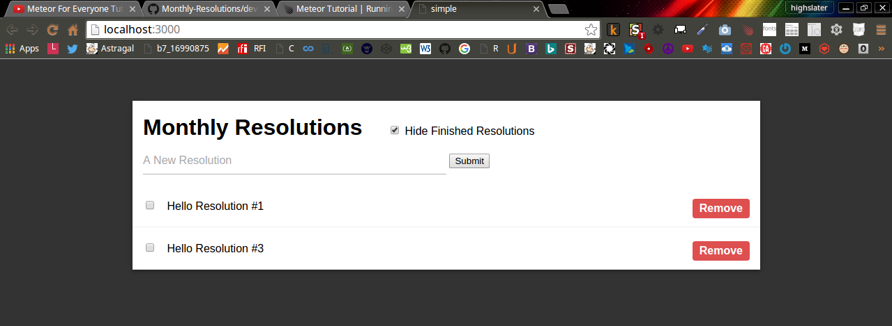

<!-- devLog -->
###Meteor For Everyone Tutorial #1 - Installing Meteor & Creating a Project:  

######Console Output:

```Console

@mint64 ~/Monthly_Resolutions/resolutions_wDefaultFileSystem 
$ meteor create resolutions

Created a new Meteor app in 'resolutions'.    

To run your new app:                          
  cd resolutions                              
  meteor                                      
                                              
If you are new to Meteor, try some of the learning resources here:
  https://www.meteor.com/learn                
                                              
@mint64 ~/Monthly_Resolutions/resolutions_wDefaultFileSystem 
$ ls
Development  resolutions
@mint64 ~/Monthly_Resolutions/resolutions_wDefaultFileSystem 
$ cd resolutions
@mint64 ~/Monthly_Resolutions/resolutions_wDefaultFileSystem/resolutions 
$ ls -hal

total 28K
drwxr-xr-x 5 highslater highslater 4.0K Apr 24 21:21 .
drwxr-xr-x 4 highslater highslater 4.0K Apr 24 21:21 ..
drwxr-xr-x 2 highslater highslater 4.0K Apr 24 21:21 client
-rw-r--r-- 1 highslater highslater   13 Apr 24 21:21 .gitignore
drwxr-xr-x 3 highslater highslater 4.0K Apr 24 21:22 .meteor
-rw-r--r-- 1 highslater highslater  152 Apr 24 21:21 package.json
drwxr-xr-x 2 highslater highslater 4.0K Apr 24 21:21 server
@mint64 ~/Monthly_Resolutions/resolutions_wDefaultFileSystem/resolutions 
$ meteor

[[[[[ ~/Monthly_Resolutions/resolutions_wDefaultFileSystem/resolutions ]]]]]

=> Started proxy.                             
=> Started MongoDB.                           
=> Started your app.                          

=> App running at: http://localhost:3000/

```

######client/main.html  

```HTML

<head>
  <title>simple</title>
</head>

<body>
  <h1>Welcome to Meteor!</h1>

  {{> hello}}
  {{> info}}
</body>

<template name="hello">
  <button>Click Me</button>
  <p>You've pressed the button {{counter}} times.</p>
</template>

<template name="info">
  <h2>Learn Meteor!</h2>
  <ul>
    <li><a href="https://www.meteor.com/try">Do the Tutorial</a></li>
    <li><a href="http://guide.meteor.com">Follow the Guide</a></li>
    <li><a href="https://docs.meteor.com">Read the Docs</a></li>
    <li><a href="https://forums.meteor.com">Discussions</a></li>
  </ul>
</template>

```

######client/main.js

```JavaScript

import { Template } from 'meteor/templating';
import { ReactiveVar } from 'meteor/reactive-var';

import './main.html';

Template.hello.onCreated(function helloOnCreated() {
  // counter starts at 0
  this.counter = new ReactiveVar(0);
});

Template.hello.helpers({
  counter() {
    return Template.instance().counter.get();
  },
});

Template.hello.events({
  'click button'(event, instance) {
    // increment the counter when button is clicked
    instance.counter.set(instance.counter.get() + 1);
  },
});

```

######server/main.js  

```JavaScript 

import { Meteor } from 'meteor/meteor';

Meteor.startup(() => {
  // code to run on server at startup
});

```

######Web Output:  


###Meteor For Everyone Tutorial #3 - Views & Templates In Meteor:  

######client/main.html  

```HTML 

<head>
  <title>simple</title>
</head>

<body>
  <ul>

  {{#each resolutions}}
    {{> resolution}}
  {{/each}}

  </ul>
</body>

<template name="resolution">
  <li>{{title}}</li>
</template>

```

######client/main.js  

```JavaScript 

import { Template } from 'meteor/templating';
import { ReactiveVar } from 'meteor/reactive-var';

import './main.html';

Template.body.helpers({
    resolutions: [
        {title: "Hello Resolution #1"},
        {title: "Hello Resolution #2"}, 
        {title: "Hello Resolution #3"} 
    ]
}); // end of Template.body.helpers

```

######Web Output:  


###Meteor For Everyone Tutorial #4 - Storing Data In Collections: 

######client/main.js 

```JavaScript 

import { Template } from 'meteor/templating';
import { ReactiveVar } from 'meteor/reactive-var';

import './main.html';

Resolutions = new Mongo.Collection('resolutions');

Template.body.helpers({
    resolutions: function() {
        return Resolutions.find();
    }
}); // end of Template.body.helpers

```

######server/main.js 

```JavaScript 

import { Meteor } from 'meteor/meteor';

Resolutions = new Mongo.Collection('resolutions');

Meteor.startup(() => {
  // code to run on server at startup
});

```
 

######Console Output:  

```Console  

@mint64 ~/Monthly_Resolutions/resolutions_wDefaultFileSystem/resolutions 
$ meteor mongo

MongoDB shell version: 2.6.7
connecting to: 127.0.0.1:3001/meteor
meteor:PRIMARY> db.resolutions.insert({title:"Hello Resolution #1", createdAt: new Date()});
WriteResult({ "nInserted" : 1 })
meteor:PRIMARY> db.resolutions.insert({title:"Hello Resolution #2", createdAt: new Date()});
WriteResult({ "nInserted" : 1 })
meteor:PRIMARY> db.resolutions.insert({title:"Hello Resolution #3", createdAt: new Date()});
WriteResult({ "nInserted" : 1 })
meteor:PRIMARY> 

```

######Web Output:


###Meteor For Everyone Tutorial #5 - Adding Data With Forms:

######client/main.html  


```HTML  

<head>
  <title>simple</title>
</head>

<body>
  <div class="container">
        <header>
            <h1>Monthly Resolutions</h1>
            <form class="new-resolution">
                <input type="text" name="title" placeholder="A New Resolution">
                <input type="submit" value="Submit">
            </form>
        </header>
        <ul>
              {{#each resolutions}}
                {{> resolution}}
              {{/each}}
        </ul> 
  </div>
</body>

<template name="resolution">
  <li>{{title}}</li>
</template>

```

######client/main.js  

```JavaScript  

import { Template } from 'meteor/templating';
import { ReactiveVar } from 'meteor/reactive-var';

import './main.html';

Resolutions = new Mongo.Collection('resolutions');

Template.body.helpers({
    resolutions: function() {
        return Resolutions.find();
    }, // end of resolutions
}); // end of Template.body.helpers

Template.body.events( {
    'submit .new-resolution': function(event) {
        var title = event.target.title.value;

        Resolutions.insert({
            title: title,
            createdAt: new Date()
        }); // end of Resolutions.insert

        event.target.title.value = "";
        return false;

    }, // end of submit .new-resolution
});

```


###Meteor For Everyone Tutorial #6 - Deleting & Updating Collections In Meteor:  

######client/main.html  

```HTML  

<head>
    <title>simple</title>
</head>

<body>
    <div class="container">
        <header>
            <h1>Monthly Resolutions</h1>
            <form class="new-resolution">
                <input type="text" name="title" placeholder="A New Resolution">
                <input type="submit" value="Submit">
            </form>
        </header>
        <ul>
            {{#each resolutions}}
            {{> resolution}}
            {{/each}}
      </ul> 
  </div>
</body>

<template name="resolution">
    <li class="{{#if checked}} checked {{/if}}">
        <input type="checkbox" checked="{{checked}}" class="toggle-checked">
        <span class="text">{{title}}</span>
        <button class="delete">Remove</button>
    </li>
</template>

```

######client/main.js  

```JavaScript  


Template.body.events( {
    'submit .new-resolution': function(event) {
        var title = event.target.title.value;

        Resolutions.insert({
            title: title,
            createdAt: new Date()
        }); // end of Resolutions.insert

        event.target.title.value = "";
        return false;

    }, // end of submit .new-resolution
});

Template.resolution.events({

    'click .toggle-checked': function () {
        Resolutions.update(this._id, {
            $set: {
                checked: !this.checked
            } // end of $set
        }); // end of Resolutions.update
    }, // end of click .toggle-checked

    'click .delete': function () {
        Resolutions.remove(this._id);
    }, // end of click .delete
}); // end of Template.resolution.events

```

######Web Output:  


###Meteor For Everyone Tutorial #7 - Temporary Session Data in Meteor:  

######Console Output:  

```Console

@mint64 ~/Monthly_Resolutions/resolutions_wDefaultFileSystem/resolutions 
$ meteor add session
                                              
Changes to your project's package version selections:
                                              
reactive-dict  added, version 1.1.7           
session        added, version 1.1.5

                                              
session: Session variable        

```

######client/main.html  


```HTML  

<head>
    <title>simple</title>
</head>

<body>
    <div class="container">
        <header>
            <h1>Monthly Resolutions</h1>
            <label class="hide-finished">
                <input type="checkbox" checked="{{hideFinished}}">
                Hide Finished Resolutions
            </label>
            <form class="new-resolution">
                <input type="text" name="title" placeholder="A New Resolution">
                <input type="submit" value="Submit">
            </form>
        </header>
        <ul>
            {{#each resolutions}}
            {{> resolution}}
            {{/each}}
      </ul> 
  </div>
</body>

<template name="resolution">
    <li class="{{#if checked}} checked {{/if}}">
        <input type="checkbox" checked="{{checked}}" class="toggle-checked">
        <span class="text">{{title}}</span>
        <button class="delete">Remove</button>
    </li>
</template>

```


######client/main.js  

```JavaScript  

import { Template } from 'meteor/templating';
import { ReactiveVar } from 'meteor/reactive-var';

import './main.html';

Resolutions = new Mongo.Collection('resolutions');

Template.body.helpers({
    resolutions: function() {
        if (Session.get('hideFinished')) {
            return Resolutions.find({checked: {$ne: true}});
        } // end of if 
        else {
            return Resolutions.find();
        } // end of else    
    }, // end of resolutions

    hideFinished: function() {
        return Session.get('hideFinished');
    }, // end of hideFinished
}); // end of Template.body.helpers

Template.body.events( {
    'submit .new-resolution': function(event) {
        var title = event.target.title.value;
        Resolutions.insert({
            title: title,
            createdAt: new Date()
        }); // end of Resolutions.insert
        event.target.title.value = "";
        return false;
    }, // end of submit .new-resolution

    'change .hide-finished': function(event) {
        Session.set('hideFinished', event.target.checked);
    }, // end of change .hide-finished
});

Template.resolution.events({

    'click .toggle-checked': function () {
        Resolutions.update(this._id, {
            $set: {
                checked: !this.checked
            } // end of $set
        }); // end of Resolutions.update
    }, // end of click .toggle-checked

    'click .delete': function () {
        Resolutions.remove(this._id);
    }, // end of click .delete
}); // end of Template.resolution.events

```


######Web Output:  

######Unchecked:  

  

######checked:

