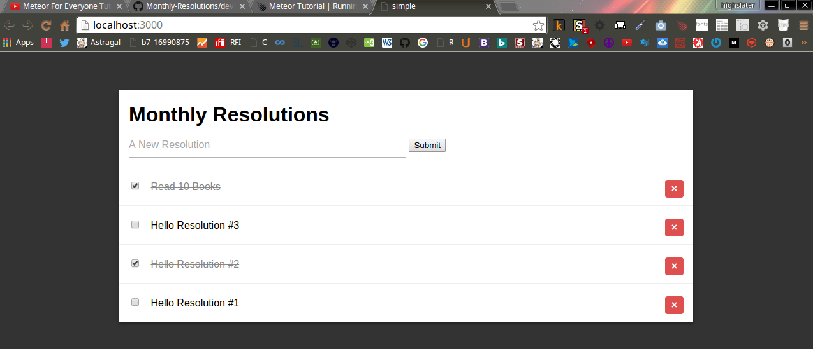
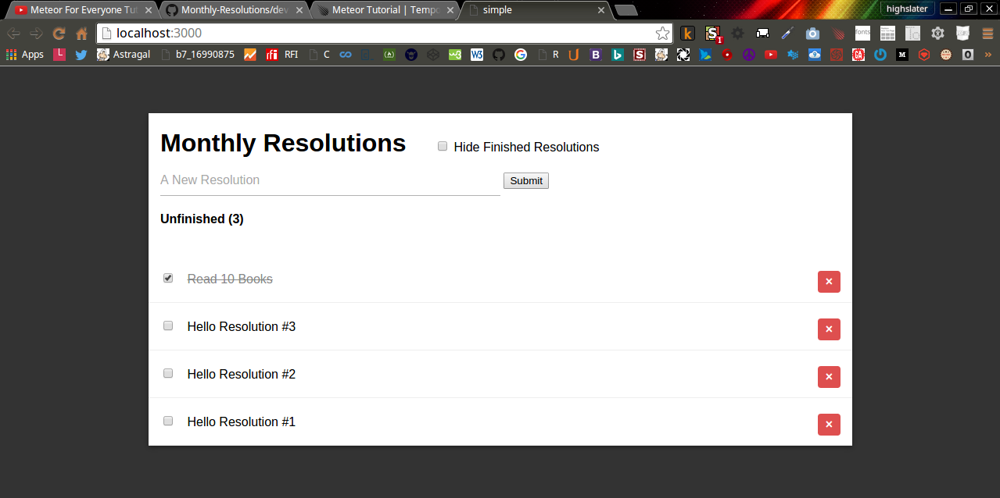
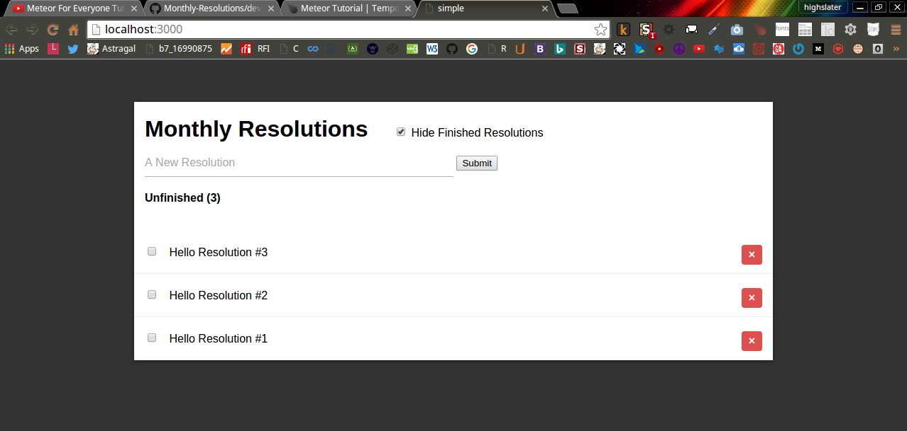
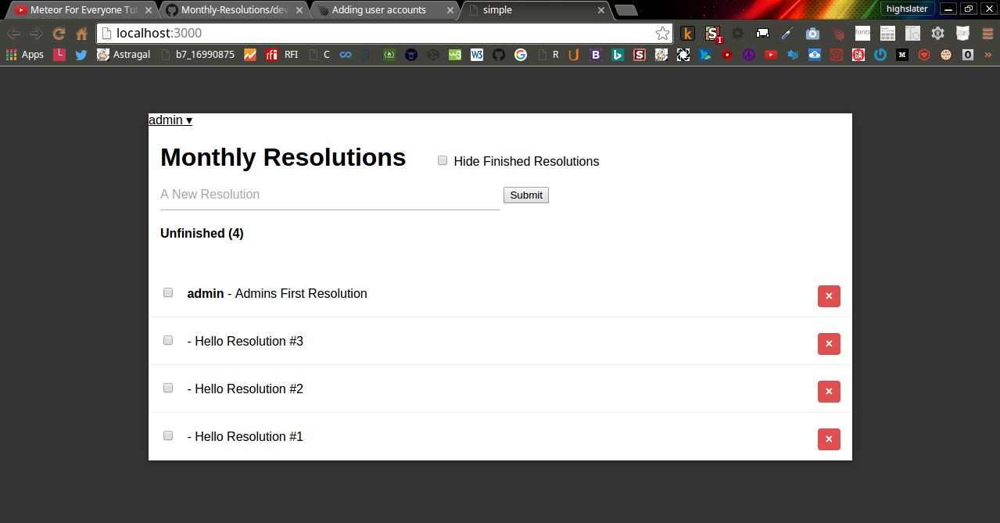

<!-- devLog -->

###Meteor For Everyone Tutorial #1 - Installing Meteor & Creating a Project:  

######Console Output:  

```Console  
@mint64 ~/Monthly_Resolutions/resolutions_wMeteorTutorial 
$ meteor create resolutions

Created a new Meteor app in 'resolutions'.    

To run your new app:                          
  cd resolutions                              
  meteor                                      
                                              
If you are new to Meteor, try some of the learning resources here:
  https://www.meteor.com/learn                
                                              
@mint64 ~/Monthly_Resolutions/resolutions_wMeteorTutorial 
$ ls
Development  resolutions
@mint64 ~/Monthly_Resolutions/resolutions_wMeteorTutorial 
$ cd resolutions
@mint64 ~/Monthly_Resolutions/resolutions_wMeteorTutorial/resolutions 
$ ls -hal

total 28K
drwxr-xr-x 5 highslater highslater 4.0K Apr 24 21:52 .
drwxr-xr-x 4 highslater highslater 4.0K Apr 24 21:52 ..
drwxr-xr-x 2 highslater highslater 4.0K Apr 24 21:52 client
-rw-r--r-- 1 highslater highslater   13 Apr 24 21:52 .gitignore
drwxr-xr-x 3 highslater highslater 4.0K Apr 24 21:53 .meteor
-rw-r--r-- 1 highslater highslater  152 Apr 24 21:52 package.json
drwxr-xr-x 2 highslater highslater 4.0K Apr 24 21:52 server
@mint64 ~/Monthly_Resolutions/resolutions_wMeteorTutorial/resolutions 
$ meteor

[[[[[~/Monthly_Resolutions/resolutions_wMeteorTutorial/resolutions]]]]]

=> Started proxy.                             
=> Started MongoDB.                           
=> Started your app.                          

=> App running at: http://localhost:3000/

```

######client/main.html  

```HTML 

<head>
  <title>simple</title>
</head>

<body>
  <h1>Welcome to Meteor!</h1>

  {{> hello}}
  {{> info}}
</body>

<template name="hello">
  <button>Click Me</button>
  <p>You've pressed the button {{counter}} times.</p>
</template>

<template name="info">
  <h2>Learn Meteor!</h2>
  <ul>
    <li><a href="https://www.meteor.com/try">Do the Tutorial</a></li>
    <li><a href="http://guide.meteor.com">Follow the Guide</a></li>
    <li><a href="https://docs.meteor.com">Read the Docs</a></li>
    <li><a href="https://forums.meteor.com">Discussions</a></li>
  </ul>
</template>

```

######client/main.js  

```JavaScript  

import { Template } from 'meteor/templating';
import { ReactiveVar } from 'meteor/reactive-var';

import './main.html';

Template.hello.onCreated(function helloOnCreated() {
  // counter starts at 0
  this.counter = new ReactiveVar(0);
});

Template.hello.helpers({
  counter() {
    return Template.instance().counter.get();
  },
});

Template.hello.events({
  'click button'(event, instance) {
    // increment the counter when button is clicked
    instance.counter.set(instance.counter.get() + 1);
  },
});

```

######server/main.js  

```JavaScript

import { Meteor } from 'meteor/meteor';

Meteor.startup(() => {
  // code to run on server at startup
});

```

######Web Output:  


###Meteor For Everyone Tutorial #3 - Views & Templates In Meteor:  

#####Change This File Structure:  

  

#####To This File Structure:  


######client/main.html  

```HTML  

<head>
  <title>simple</title>
</head>

```

######client/main.js  

```JavaScript

import '../imports/ui/body.js';

```

######imports/ui/body.html  

```HTML

<body>
  <ul>

  {{#each resolutions}}
    {{> resolution}}
  {{/each}}
  
  </ul>
</body>

<template name="resolution">
  <li>{{title}}</li>
</template>

```

######imports/ui/body.js  

```JavaScript

import { Template } from 'meteor/templating';
import { ReactiveVar } from 'meteor/reactive-var';

import './body.html';

Template.body.helpers({
    resolutions: [
        {title: "Hello Resolution #1"},
        {title: "Hello Resolution #2"},
        {title: "Hello Resolution #3"}
    ]
});

```

######Web Output:

  

###Meteor For Everyone Tutorial #4 - Storing Data In Collections:  


######imports/api/resolutions.js  

```JavaScript 

import { Mongo } from 'meteor/mongo';

export const Resolutions = new Mongo.Collection('resolutions');

```


######server/main.js  

```JavaScript  

import { Meteor } from 'meteor/meteor';
import '../imports/api/resolutions.js';

Meteor.startup(() => {
  // code to run on server at startup
});

```


######imports/ui/body.js  

```JavaScript  

import { Template } from 'meteor/templating';
import { ReactiveVar } from 'meteor/reactive-var';
import { Resolutions } from '../api/resolutions.js';
import './body.html';


Template.body.helpers({
    resolutions: function() {
        return Resolutions.find();
    }
});

```

######Console Output:

```Console 

@mint64 ~/Programming/Meteor/LevelUpTuts/Monthly_Resolutions/resolutions_wMeteorTutorial/resolutions 
$ meteor mongo

MongoDB shell version: 2.6.7
connecting to: 127.0.0.1:3001/meteor
meteor:PRIMARY> db.resolutions.insert({ text: "Hello Resolutions #1", createdAt: new Date() });
WriteResult({ "nInserted" : 1 })
meteor:PRIMARY> db.resolutions.insert({ text: "Hello Resolutions #2", createdAt: new Date() });
WriteResult({ "nInserted" : 1 })
meteor:PRIMARY> db.resolutions.insert({ text: "Hello Resolutions #3", createdAt: new Date() });
WriteResult({ "nInserted" : 1 })
meteor:PRIMARY> 

```

######Web Output:

  


######File Structure:

  

###Meteor For Everyone Tutorial #5 - Adding Data With Forms:  

######imports/ui/body.html  

```HTML  

<body>
<div class="container">
    <header>
        <h1>Monthly Resolutions</h1>
        <form class="new-resolution">
            <input type="text" name="text" placeholder="A New Resolution">
            <input type="submit" value="Submit">
        </form>
    </header>
    <ul>
        {{#each resolutions}}
          {{> resolution}}
        {{/each}}
    </ul>
</div>
</body>
<template name="resolution">
  <li>{{text}}</li>
</template>

```

######imports/ui/body.js  

```JavaScript  

import { Template } from 'meteor/templating';
import { ReactiveVar } from 'meteor/reactive-var';
import { Resolutions } from '../api/resolutions.js';
import './body.html';


Template.body.helpers({
    resolutions: function() {
        // see the newest tasks first.
        return Resolutions.find({}, { sort: {createdAt: -1} });
    } // end of resolutions
}); // end of Template.body.helpers

Template.body.events({
    'submit .new-resolution': function(event) {
        // Prevent default browser form submit
        event.preventDefault();

        // Get value from form element
        const target = event.target;
        const text = target.text.value; 

        // Insert a task into the collection
        Resolutions.insert({
            text,
            createdAt: new Date() // current time
        }); // end of Resolutions.insert

        // Clear form
        target.text.value = "";

    } // end of submit .new-resolution
}); // end of Template.body.events

```


######Web Output:  

  


###Meteor For Everyone Tutorial #6 - Deleting & Updating Collections In Meteor:  

######imports/ui/body.html  

```HTML  

<body>
<div class="container">
    <header>
        <h1>Monthly Resolutions</h1>
        <form class="new-resolution">
            <input type="text" name="text" placeholder="A New Resolution">
            <input type="submit" value="Submit">
        </form>
    </header>
    <ul>
        {{#each resolutions}}
          {{> resolution}}
        {{/each}}
    </ul>
</div>
</body>

```


######imports/ui/body.js  

```JavaScript  

import { Template } from 'meteor/templating';
import { ReactiveVar } from 'meteor/reactive-var';
import { Resolutions } from '../api/resolutions.js';
import './resolution.js';
import './body.html';


Template.body.helpers({
    resolutions: function() {
        // see the newest tasks first.
        return Resolutions.find({}, { sort: {createdAt: -1} });
    } // end of resolutions
}); // end of Template.body.helpers

Template.body.events({
    'submit .new-resolution': function(event) {
        // Prevent default browser form submit
        event.preventDefault();

        // Get value from form element
        const target = event.target;
        const text = target.text.value; 

        // Insert a task into the collection
        Resolutions.insert({
            text,
            createdAt: new Date() // current time
        }); // end of Resolutions.insert

        // Clear form
        target.text.value = "";

    } // end of submit .new-resolution
}); // end of Template.body.events

```

######imports/ui/resolution.html  

```HTML  

<template name="resolution">
    <li class="{{#if checked}} checked {{/if}}">
        <input type="checkbox" checked="{{checked}}" class="toggle-checked">
        <span class="text">{{text}}</span>
        <button class="delete">&times;</button>
    </li>
</template>

```


######imports/ui/resolution.js  

```JavaScript  

import { Template } from 'meteor/templating';
import { ReactiveVar } from 'meteor/reactive-var';
import { Resolutions } from '../api/resolutions.js';
import './body.html';
import './resolution.html';

Template.resolution.events({
    'click .toggle-checked': function() {
        Resolutions.update(
            this._id, {
            $set: {
                checked: !this.checked
            }, // end of $set
        }); // end of Resolutions.update
    }, // end of click .toggle-checked

    'click .delete': function() {
        Resolutions.remove(this._id);
    }, // end of click .delete

}); // end of Template.resolution.events

```

######Web Output:  



###Meteor For Everyone Tutorial #7 - Temporary Session Data in Meteor:  

######Console Output:  


```Console  

@mint64 ~/Monthly_Resolutions/resolutions_wMeteorTutorial/resolutions 
$ meteor list

autopublish            1.0.7  (For prototyping only) Publish the entire datab...
blaze-html-templates   1.0.4  Compile HTML templates into reactive UI with Me...
ecmascript             0.4.3  Compiler plugin that supports ES2015+ in all .j...
es5-shim               4.5.10  Shims and polyfills to improve ECMAScript 5 su...
insecure               1.0.7  (For prototyping only) Allow all database write...
jquery                 1.11.8  Manipulate the DOM using CSS selectors
meteor-base            1.0.4  Packages that every Meteor app needs
mobile-experience      1.0.4  Packages for a great mobile user experience
mongo                  1.1.7  Adaptor for using MongoDB and Minimongo over DDP
reactive-var    
standard-minifier-css  1.0.6  Standard css minifier used with Meteor apps by ...
standard-minifier-js   1.0.6  Standard javascript minifiers used with Meteor ...
tracker                1.0.13  Dependency tracker to allow reactive callbacks

@mint64 ~/Monthly_Resolutions/resolutions_wMeteorTutorial/resolutions 
$ meteor add reactive-dict
                                              
Changes to your project's package version selections:                                            
reactive-dict  added, version 1.1.7                                                       
reactive-dict: Reactive dictionary 

@mint64 ~/Monthly_Resolutions/resolutions_wMeteorTutorial/resolutions 
$ meteor list

autopublish            1.0.7  (For prototyping only) Publish the entire datab...
blaze-html-templates   1.0.4  Compile HTML templates into reactive UI with Me...
ecmascript             0.4.3  Compiler plugin that supports ES2015+ in all .j...
es5-shim               4.5.10  Shims and polyfills to improve ECMAScript 5 su...
insecure               1.0.7  (For prototyping only) Allow all database write...
jquery                 1.11.8  Manipulate the DOM using CSS selectors
meteor-base            1.0.4  Packages that every Meteor app needs
mobile-experience      1.0.4  Packages for a great mobile user experience
mongo                  1.1.7  Adaptor for using MongoDB and Minimongo over DDP
reactive-dict          1.1.7  Reactive dictionary
reactive-var           1.0.9  Reactive variable
standard-minifier-css  1.0.6  Standard css minifier used with Meteor apps by ...
standard-minifier-js   1.0.6  Standard javascript minifiers used with Meteor ...
tracker                1.0.13  Dependency tracker to allow reactive callbacks

@mint64 ~/Monthly_Resolutions/resolutions_wMeteorTutorial/resolutions 
$ meteor show reactive-dict 

Package: reactive-dict@1.1.7                  
Maintainers: mdg                              
Exports: ReactiveDict                         
                                              
This package provide `ReactiveDict`, a general-purpose reactive
datatype for use with
[tracker](https://atmospherejs.com/meteor/tracker). It provides all of
the functionality of the `Session` object documented in the [main
Meteor docs](https://docs.meteor.com/#session), such as reactive
`get`, `set`, and `equals` functions.

If you provide a name to its constructor, its contents will be saved across Hot
Code Push client code updates.

Example usage:

    js
var dict = new ReactiveDict('myDict');
dict.set("weather", "cloudy");
Tracker.autorun(function () { console.log("now " + dict.get("weather")); });
// now cloudy
dict.set("weather", "sunny");
// now sunny

For more information, see the [Tracker project
page](https://www.meteor.com/tracker).
                                              
Recent versions:                              
  1.1.2  September 28th, 2015                 
  1.1.3  October 26th, 2015    installed
  1.1.5  March 27th, 2016      installed
  1.1.6  April 3rd, 2016       installed
  1.1.7  April 15th, 2016      installed

Older and pre-release versions of reactive-dict have been hidden. To see all 93
versions, run 'meteor show --show-all reactive-dict'.

```


######imports/ui/body.html  

```HTML  

<body>
<div class="container">
    <header>
        <h1>Monthly Resolutions</h1>


        <label class="hide-finished">
            <input type="checkbox">
            Hide Finished Resolutions
        </label>

        <form class="new-resolution">
            <input type="text" name="text" placeholder="A New Resolution">
            <input type="submit" value="Submit">
        </form>
        <h4>Unfinished ({{incompleteCount}})</h4>
    </header>
    <ul>
        {{#each resolutions}}
          {{> resolution}}
        {{/each}}
    </ul>
</div>
</body>

```

######imports/ui/body.js  


```JavaScript  

import { Template } from 'meteor/templating';
import { ReactiveVar } from 'meteor/reactive-var';
import { ReactiveDict } from 'meteor/reactive-dict';

import { Resolutions } from '../api/resolutions.js';

import './resolution.js';
import './body.html';

Template.body.onCreated(function bodyOnCreated() {
    this.state = new ReactiveDict();
}); // end of Template.body.onCreated

Template.body.helpers({
    resolutions: function() {
        const instance = Template.instance();
        if (instance.state.get('hideFinished')) {
            return Resolutions.find({checked: {$ne: true}}, {sort: {createdAt: -1}});
        } // end of if
        else {
            // see the newest tasks first.
            return Resolutions.find({}, {sort: {createdAt: -1}});
        } // end of else
            // see the newest tasks first.
            return Resolutions.find({}, { sort: {createdAt: -1} });
    }, // end of resolutions

    incompleteCount: function() {
        return Resolutions.find({ checked: {$ne: true }}).count();
    }, // end of incompleteCount
}); // end of Template.body.helpers

Template.body.events({
    'submit .new-resolution': function(event) {
        // Prevent default browser form submit
        event.preventDefault();
        // Get value from form element
        const target = event.target;
        const text = target.text.value; 
        // Insert a task into the collection
        Resolutions.insert({
            text,
            createdAt: new Date() // current time
        }); // end of Resolutions.insert
        // Clear form
        target.text.value = "";
    }, // end of submit .new-resolution

    'change .hide-finished input': function(event, instance) {
        instance.state.set('hideFinished', event.target.checked);
    }, // end of change .hide-finished input


}); // end of Template.body.events

```

######Web Output:  

######Unchecked:



######Checked:




###Meteor For Everyone Tutorial #9 - Easy User Accounts With Meteor Accounts UI:  

######Console Output:  


```Console  

@mint64 ~/Monthly_Resolutions/resolutions_wMeteorTutorial/resolutions 
$ meteor add accounts-ui accounts-password
                                              
Changes to your project's package version selections:
                                              
accounts-base          added, version 1.2.7   
accounts-password      added, version 1.1.8
accounts-ui            added, version 1.1.9
accounts-ui-unstyled   added, version 1.1.12
ddp-rate-limiter       added, version 1.0.4
email                  added, version 1.0.12
less                   added, version 2.6.0
localstorage           added, version 1.0.9
npm-bcrypt             added, version 0.8.5
rate-limit             added, version 1.0.4
service-configuration  added, version 1.0.9
session                added, version 1.1.5
sha                    added, version 1.0.7
srp                    added, version 1.0.8
                                           
accounts-ui: Simple templates to add login widgets to an app
accounts-password: Password support for accounts

@mint64 ~/Monthly_Resolutions/resolutions_wMeteorTutorial/resolutions 
$ meteor list

accounts-password      1.1.8  Password support for accounts
accounts-ui            1.1.9  Simple templates to add login widgets to an app
autopublish            1.0.7  (For prototyping only) Publish the entire datab...
blaze-html-templates   1.0.4  Compile HTML templates into reactive UI with Me...
ecmascript             0.4.3  Compiler plugin that supports ES2015+ in all .j...
es5-shim               4.5.10  Shims and polyfills to improve ECMAScript 5 su...
insecure               1.0.7  (For prototyping only) Allow all database write...
jquery                 1.11.8  Manipulate the DOM using CSS selectors
meteor-base            1.0.4  Packages that every Meteor app needs
mobile-experience      1.0.4  Packages for a great mobile user experience
mongo                  1.1.7  Adaptor for using MongoDB and Minimongo over DDP
reactive-dict          1.1.7  Reactive dictionary
reactive-var           1.0.9  Reactive variable
standard-minifier-css  1.0.6  Standard css minifier used with Meteor apps by ...
standard-minifier-js   1.0.6  Standard javascript minifiers used with Meteor ...
tracker                1.0.13  Dependency tracker to allow reactive callbacks

```

######imports/ui/body.html  

```HTML  

<body>
<div class="container">

{{>loginButtons}}
    <header>
        <h1>Monthly Resolutions</h1>
        <label class="hide-finished">
            <input type="checkbox">
            Hide Finished Resolutions
        </label>
    {{#if currentUser}}
        <form class="new-resolution">
            <input type="text" name="text" placeholder="A New Resolution">
            <input type="submit" value="Submit">
        </form>
    {{/if}}
        <h4>Unfinished ({{incompleteCount}})</h4>
    </header>
    <ul>
        {{#each resolutions}}
          {{> resolution}}
        {{/each}}
    </ul>
</div>
</body>

```


######imports/startup/accounts-config.js  

```JavaScript  

import { Accounts } from 'meteor/accounts-base';

Accounts.ui.config({
    passwordSignupFields: "USERNAME_ONLY",
});

```

######client/main.js  

```JavaScript  

import '../imports/ui/body.js';
import '../imports/startup/accounts-config.js';
import '../imports/ui/body.js';

```

######imports/ui/body.js  

```JavaScript  

import { Template } from 'meteor/templating';
import { ReactiveVar } from 'meteor/reactive-var';
import { ReactiveDict } from 'meteor/reactive-dict';

import { Resolutions } from '../api/resolutions.js';

import './resolution.js';
import './body.html';

Template.body.onCreated(function bodyOnCreated() {
    this.state = new ReactiveDict();
}); // end of Template.body.onCreated

Template.body.helpers({
    resolutions: function() {
        const instance = Template.instance();
        if (instance.state.get('hideFinished')) {
            return Resolutions.find({checked: {$ne: true}}, {sort: {createdAt: -1}});
        } // end of if
        else {
            // see the newest tasks first.
            return Resolutions.find({}, {sort: {createdAt: -1}});
        } // end of else
            // see the newest tasks first.
            return Resolutions.find({}, { sort: {createdAt: -1} });
    }, // end of resolutions

    incompleteCount: function() {
        return Resolutions.find({ checked: {$ne: true }}).count();
    }, // end of incompleteCount
}); // end of Template.body.helpers

Template.body.events({
    'submit .new-resolution': function(event) {
        // Prevent default browser form submit
        event.preventDefault();
        // Get value from form element
        const target = event.target;
        const text = target.text.value; 
        // Insert a task into the collection
        Resolutions.insert({
            text,
            createdAt: new Date(), // current time
            owner: Meteor.userId(),
            username: Meteor.user().username
        }); // end of Resolutions.insert
        // Clear form
        target.text.value = "";
    }, // end of submit .new-resolution

    'change .hide-finished input': function(event, instance) {
        instance.state.set('hideFinished', event.target.checked);
    }, // end of change .hide-finished input


}); // end of Template.body.events

```

######imports/ui/resolution.html  

```JavaScript  

<template name="resolution">
    <li class="{{#if checked}} checked {{/if}}">
        <input type="checkbox" checked="{{checked}}" class="toggle-checked">
        <span class="text"><strong>{{username}}</strong> - {{text}}</span>
        <button class="delete">&times;</button>
    </li>
</template>

```

######Web Output:  




###Meteor For Everyone Tutorial #14 - Making Your Meteor App More Secure:  


```Console  

@mint64 ~/Monthly_Resolutions/resolutions_wMeteorTutorial/resolutions 
$ meteor remove insecure
                                              
Changes to your project's package version selections:
                                              
insecure  removed from your project           
insecure: removed dependency

@mint64 ~/Monthly_Resolutions/resolutions_wMeteorTutorial/resolutions 
$ meteor list

accounts-password      1.1.8  Password support for accounts
accounts-ui            1.1.9  Simple templates to add login widgets to an app
autopublish            1.0.7  (For prototyping only) Publish the entire datab...
blaze-html-templates   1.0.4  Compile HTML templates into reactive UI with Me...
ecmascript             0.4.3  Compiler plugin that supports ES2015+ in all .j...
es5-shim               4.5.10  Shims and polyfills to improve ECMAScript 5 su...
jquery                 1.11.8  Manipulate the DOM using CSS selectors
meteor-base            1.0.4  Packages that every Meteor app needs
mobile-experience      1.0.4  Packages for a great mobile user experience
mongo                  1.1.7  Adaptor for using MongoDB and Minimongo over DDP
reactive-dict          1.1.7  Reactive dictionary
reactive-var           1.0.9  Reactive variable
standard-minifier-css  1.0.6  Standard css minifier used with Meteor apps by ...
standard-minifier-js   1.0.6  Standard javascript minifiers used with Meteor ...
tracker                1.0.13  Dependency tracker to allow reactive callbacks


```

######imports/api/resolutions.js  

```JavaScript  

import { Meteor } from 'meteor/meteor';
import { Mongo } from 'meteor/mongo';
import { check } from 'meteor/check';

export const Resolutions = new Mongo.Collection('resolutions');

Meteor.methods({

    'resolutions.insert': function(text) {
 //       check(text, String);
 //       // Make sure the user is logged in before inserting a task
 //       if (! this.userId) {
 //         throw new Meteor.Error('not-authorized');
 //       }
         Resolutions.insert({
            text,
            createdAt: new Date(), // current time
            owner: Meteor.userId(),
            username: Meteor.users.findOne(this.userId).username
        }); // end of Resolutions.insert
    }, // end of resolutions.insert

}); // end of Meteor.methods

```

######imports/ui/body.js  

```JavaScript  

import { Template } from 'meteor/templating';
import { ReactiveVar } from 'meteor/reactive-var';
import { ReactiveDict } from 'meteor/reactive-dict';

import { Resolutions } from '../api/resolutions.js';

import './resolution.js';
import './body.html';

Template.body.onCreated(function bodyOnCreated() {
    this.state = new ReactiveDict();
}); // end of Template.body.onCreated

Template.body.helpers({
    resolutions: function() {
        const instance = Template.instance();
        if (instance.state.get('hideFinished')) {
            return Resolutions.find({checked: {$ne: true}}, {sort: {createdAt: -1}});
        } // end of if
        else {
            // see the newest tasks first.
            return Resolutions.find({}, {sort: {createdAt: -1}});
        } // end of else
            // see the newest tasks first.
            return Resolutions.find({}, { sort: {createdAt: -1} });
    }, // end of resolutions

    incompleteCount: function() {
        return Resolutions.find({ checked: {$ne: true }}).count();
    }, // end of incompleteCount
}); // end of Template.body.helpers

Template.body.events({
    'submit .new-resolution': function(event) {
        // Prevent default browser form submit
        event.preventDefault();
        // Get value from form element
        const target = event.target;
        const text = target.text.value; 
        // Insert a task into the collection
            Meteor.call('resolutions.insert', text);
        // Clear form
        target.text.value = "";
    }, // end of submit .new-resolution

    'change .hide-finished input': function(event, instance) {
        instance.state.set('hideFinished', event.target.checked);
    }, // end of change .hide-finished input
}); // end of Template.body.events

```

###Meteor For Everyone Tutorial #15 - Making Your App More Secure Part 2:  

######imports/api/resolutions.js  

```JavaScript  

import { Meteor } from 'meteor/meteor';
import { Mongo } from 'meteor/mongo';
import { check } from 'meteor/check';

export const Resolutions = new Mongo.Collection('resolutions');

Meteor.methods({
    'resolutions.insert': function(text) {
         Resolutions.insert({
            text,
            createdAt: new Date(), // current time
            owner: Meteor.userId(),
            username: Meteor.users.findOne(this.userId).username
        }); // end of Resolutions.insert
    }, // end of resolutions.insert
    'resolution.update': function(id, checked) {
        Resolutions.update(id, {
            $set: {
                checked: checked,
            } // end of $set
        }); // end of Resolutions.update
    }, // end of resolutions.update
    'resolution.delete': function(id) {
        Resolutions.remove(id);
    }, // end of resolutions.delete
}); // end of Meteor.methods

```


######imports/ui/body.js  


```JavaScript  

import { Template } from 'meteor/templating';
import { ReactiveVar } from 'meteor/reactive-var';
import { ReactiveDict } from 'meteor/reactive-dict';

import { Resolutions } from '../api/resolutions.js';

import './resolution.js';
import './body.html';

Template.body.onCreated(function bodyOnCreated() {
    this.state = new ReactiveDict();
}); // end of Template.body.onCreated

Template.body.helpers({
    resolutions: function() {
        const instance = Template.instance();
        if (instance.state.get('hideFinished')) {
            return Resolutions.find({checked: {$ne: true}}, {sort: {createdAt: -1}});
        } // end of if
        else {
            // see the newest tasks first.
            return Resolutions.find({}, {sort: {createdAt: -1}});
        } // end of else
            // see the newest tasks first.
            return Resolutions.find({}, { sort: {createdAt: -1} });
    }, // end of resolutions

    incompleteCount: function() {
        return Resolutions.find({ checked: {$ne: true }}).count();
    }, // end of incompleteCount
}); // end of Template.body.helpers

Template.body.events({
    'submit .new-resolution': function(event) {
        // Prevent default browser form submit
        event.preventDefault();
        // Get value from form element
        const target = event.target;
        const text = target.text.value; 
        // Insert a task into the collection
            Meteor.call('resolutions.insert', text);
        // Clear form
        target.text.value = "";
    }, // end of submit .new-resolution

    'change .hide-finished input': function(event, instance) {
        instance.state.set('hideFinished', event.target.checked);
    }, // end of change .hide-finished input
}); // end of Template.body.events

```

######imports/ui/resolutions.js  

```JavaScript  

import { Template } from 'meteor/templating';
import { ReactiveVar } from 'meteor/reactive-var';
import { Resolutions } from '../api/resolutions.js';
import './body.html';
import './resolution.html';

Template.resolution.events({
    'click .toggle-checked': function() {
        Meteor.call('resolution.update', this._id, !this.checked);
    }, // end of click .toggle-checked
    'click .delete': function() {
        Meteor.call('resolution.delete', this._id);
    }, // end of click .delete
}); // end of Template.resolution.events

```

###Meteor For Everyone Tutorial #16 - Introduction to Publish & Subscribe:  

######Console Output:  

```Console  

@mint64 ~/Monthly_Resolutions/resolutions_wMeteorTutorial/resolutions 
$ meteor remove autopublish
                                              
Changes to your project's package version selections:                                            
autopublish  removed from your project        
autopublish: removed dependency 

@mint64 ~/Monthly_Resolutions/resolutions_wMeteorTutorial/resolutions 
$ meteor list

accounts-password      1.1.8  Password support for accounts
accounts-ui            1.1.9  Simple templates to add login widgets to an app
blaze-html-templates   1.0.4  Compile HTML templates into reactive UI with Me...
ecmascript             0.4.3  Compiler plugin that supports ES2015+ in all .j...
es5-shim               4.5.10  Shims and polyfills to improve ECMAScript 5 su...
jquery                 1.11.8  Manipulate the DOM using CSS selectors
meteor-base            1.0.4  Packages that every Meteor app needs
mobile-experience      1.0.4  Packages for a great mobile user experience
mongo                  1.1.7  Adaptor for using MongoDB and Minimongo over DDP
reactive-dict          1.1.7  Reactive dictionary
reactive-var           1.0.9  Reactive variable
standard-minifier-css  1.0.6  Standard css minifier used with Meteor apps by ...
standard-minifier-js   1.0.6  Standard javascript minifiers used with Meteor ...
tracker                1.0.13  Dependency tracker to allow reactive callbacks

```

######imports/api/resolutions.js  

```JavaScript  

import { Meteor } from 'meteor/meteor';
import { Mongo } from 'meteor/mongo';
import { check } from 'meteor/check';

export const Resolutions = new Mongo.Collection('resolutions');

if (Meteor.isServer) {
    Meteor.publish('resolutions', function resolutionsPublication() {
        return Resolutions.find();
    }); // end of Meteor.publish
} // end of if (Meteor.isServer)

Meteor.methods({
    'resolutions.insert': function(text) {
         Resolutions.insert({
            text,
            createdAt: new Date(), // current time
            owner: Meteor.userId(),
            username: Meteor.users.findOne(this.userId).username
        }); // end of Resolutions.insert
    }, // end of resolutions.insert
    'resolution.update': function(id, checked) {
        Resolutions.update(id, {
            $set: {
                checked: checked,
            } // end of $set
        }); // end of Resolutions.update
    }, // end of resolutions.update
    'resolution.delete': function(id) {
        Resolutions.remove(id);
    }, // end of resolutions.delete
}); // end of Meteor.methods

```

######imports/ui/body.js  

```JavaScript  

import { Template } from 'meteor/templating';
import { ReactiveVar } from 'meteor/reactive-var';
import { ReactiveDict } from 'meteor/reactive-dict';

import { Resolutions } from '../api/resolutions.js';

import './resolution.js';
import './body.html';

Template.body.onCreated(function bodyOnCreated() {
    this.state = new ReactiveDict();
    Meteor.subscribe('resolutions');
}); // end of Template.body.onCreated

Template.body.helpers({
    resolutions: function() {
        const instance = Template.instance();
        if (instance.state.get('hideFinished')) {
            return Resolutions.find({checked: {$ne: true}}, {sort: {createdAt: -1}});
        } // end of if
        else {
            // see the newest tasks first.
            return Resolutions.find({}, {sort: {createdAt: -1}});
        } // end of else
            // see the newest tasks first.
            return Resolutions.find({}, { sort: {createdAt: -1} });
    }, // end of resolutions

    incompleteCount: function() {
        return Resolutions.find({ checked: {$ne: true }}).count();
    }, // end of incompleteCount
}); // end of Template.body.helpers

Template.body.events({
    'submit .new-resolution': function(event) {
        // Prevent default browser form submit
        event.preventDefault();
        // Get value from form element
        const target = event.target;
        const text = target.text.value; 
        // Insert a task into the collection
            Meteor.call('resolutions.insert', text);
        // Clear form
        target.text.value = "";
    }, // end of submit .new-resolution

    'change .hide-finished input': function(event, instance) {
        instance.state.set('hideFinished', event.target.checked);
    }, // end of change .hide-finished input
}); // end of Template.body.events

```