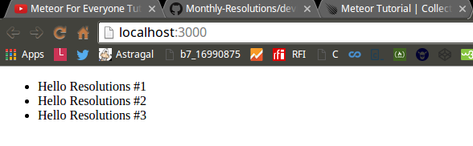

<!-- devLog -->

###Meteor For Everyone Tutorial #1 - Installing Meteor & Creating a Project:  

######Console Output:  

```Console  
@mint64 ~/Monthly_Resolutions/resolutions_wMeteorTutorial 
$ meteor create resolutions

Created a new Meteor app in 'resolutions'.    

To run your new app:                          
  cd resolutions                              
  meteor                                      
                                              
If you are new to Meteor, try some of the learning resources here:
  https://www.meteor.com/learn                
                                              
@mint64 ~/Monthly_Resolutions/resolutions_wMeteorTutorial 
$ ls
Development  resolutions
@mint64 ~/Monthly_Resolutions/resolutions_wMeteorTutorial 
$ cd resolutions
@mint64 ~/Monthly_Resolutions/resolutions_wMeteorTutorial/resolutions 
$ ls -hal

total 28K
drwxr-xr-x 5 highslater highslater 4.0K Apr 24 21:52 .
drwxr-xr-x 4 highslater highslater 4.0K Apr 24 21:52 ..
drwxr-xr-x 2 highslater highslater 4.0K Apr 24 21:52 client
-rw-r--r-- 1 highslater highslater   13 Apr 24 21:52 .gitignore
drwxr-xr-x 3 highslater highslater 4.0K Apr 24 21:53 .meteor
-rw-r--r-- 1 highslater highslater  152 Apr 24 21:52 package.json
drwxr-xr-x 2 highslater highslater 4.0K Apr 24 21:52 server
@mint64 ~/Monthly_Resolutions/resolutions_wMeteorTutorial/resolutions 
$ meteor

[[[[[~/Monthly_Resolutions/resolutions_wMeteorTutorial/resolutions]]]]]

=> Started proxy.                             
=> Started MongoDB.                           
=> Started your app.                          

=> App running at: http://localhost:3000/

```

######client/main.html  

```HTML 

<head>
  <title>simple</title>
</head>

<body>
  <h1>Welcome to Meteor!</h1>

  {{> hello}}
  {{> info}}
</body>

<template name="hello">
  <button>Click Me</button>
  <p>You've pressed the button {{counter}} times.</p>
</template>

<template name="info">
  <h2>Learn Meteor!</h2>
  <ul>
    <li><a href="https://www.meteor.com/try">Do the Tutorial</a></li>
    <li><a href="http://guide.meteor.com">Follow the Guide</a></li>
    <li><a href="https://docs.meteor.com">Read the Docs</a></li>
    <li><a href="https://forums.meteor.com">Discussions</a></li>
  </ul>
</template>

```

######client/main.js  

```JavaScript  

import { Template } from 'meteor/templating';
import { ReactiveVar } from 'meteor/reactive-var';

import './main.html';

Template.hello.onCreated(function helloOnCreated() {
  // counter starts at 0
  this.counter = new ReactiveVar(0);
});

Template.hello.helpers({
  counter() {
    return Template.instance().counter.get();
  },
});

Template.hello.events({
  'click button'(event, instance) {
    // increment the counter when button is clicked
    instance.counter.set(instance.counter.get() + 1);
  },
});

```

######server/main.js  

```JavaScript

import { Meteor } from 'meteor/meteor';

Meteor.startup(() => {
  // code to run on server at startup
});

```

######Web Output:  


###Meteor For Everyone Tutorial #3 - Views & Templates In Meteor:  

#####Change This File Structure:  

  

#####To This File Structure:  


######client/main.html  

```HTML  

<head>
  <title>simple</title>
</head>

```

######client/main.js  

```JavaScript

import '../imports/ui/body.js';

```

######imports/ui/body.html  

```HTML

<body>
  <ul>

  {{#each resolutions}}
    {{> resolution}}
  {{/each}}
  
  </ul>
</body>

<template name="resolution">
  <li>{{title}}</li>
</template>

```

######imports/ui/body.js  

```JavaScript

import { Template } from 'meteor/templating';
import { ReactiveVar } from 'meteor/reactive-var';

import './body.html';

Template.body.helpers({
    resolutions: [
        {title: "Hello Resolution #1"},
        {title: "Hello Resolution #2"},
        {title: "Hello Resolution #3"}
    ]
});

```

######Web Output:

  

###Meteor For Everyone Tutorial #4 - Storing Data In Collections:  


######imports/api/resolutions.js  

```JavaScript 

import { Mongo } from 'meteor/mongo';

export const Resolutions = new Mongo.Collection('resolutions');

```


######server/main.js  

```JavaScript  

import { Meteor } from 'meteor/meteor';
import '../imports/api/resolutions.js';

Meteor.startup(() => {
  // code to run on server at startup
});

```


######imports/ui/body.js  

```JavaScript  

import { Template } from 'meteor/templating';
import { ReactiveVar } from 'meteor/reactive-var';
import { Resolutions } from '../api/resolutions.js';
import './body.html';


Template.body.helpers({
    resolutions: function() {
        return Resolutions.find();
    }
});

```

######Console Output:

```Console 

@mint64 ~/Programming/Meteor/LevelUpTuts/Monthly_Resolutions/resolutions_wMeteorTutorial/resolutions 
$ meteor mongo

MongoDB shell version: 2.6.7
connecting to: 127.0.0.1:3001/meteor
meteor:PRIMARY> db.resolutions.insert({ text: "Hello Resolutions #1", createdAt: new Date() });
WriteResult({ "nInserted" : 1 })
meteor:PRIMARY> db.resolutions.insert({ text: "Hello Resolutions #2", createdAt: new Date() });
WriteResult({ "nInserted" : 1 })
meteor:PRIMARY> db.resolutions.insert({ text: "Hello Resolutions #3", createdAt: new Date() });
WriteResult({ "nInserted" : 1 })
meteor:PRIMARY> 

```

######Web Output:

  


######File Structure:

  

###Meteor For Everyone Tutorial #5 - Adding Data With Forms:  

######imports/ui/body.html  

```HTML  

<body>
<div class="container">
    <header>
        <h1>Monthly Resolutions</h1>
        <form class="new-resolution">
            <input type="text" name="text" placeholder="A New Resolution">
            <input type="submit" value="Submit">
        </form>
    </header>
    <ul>
        {{#each resolutions}}
          {{> resolution}}
        {{/each}}
    </ul>
</div>
</body>
<template name="resolution">
  <li>{{text}}</li>
</template>

```

######imports/ui/body.js  

```JavaScript  

import { Template } from 'meteor/templating';
import { ReactiveVar } from 'meteor/reactive-var';
import { Resolutions } from '../api/resolutions.js';
import './body.html';


Template.body.helpers({
    resolutions: function() {
        // see the newest tasks first.
        return Resolutions.find({}, { sort: {createdAt: -1} });
    } // end of resolutions
}); // end of Template.body.helpers

Template.body.events({
    'submit .new-resolution': function(event) {
        // Prevent default browser form submit
        event.preventDefault();

        // Get value from form element
        const target = event.target;
        const text = target.text.value; 

        // Insert a task into the collection
        Resolutions.insert({
            text,
            createdAt: new Date() // current time
        }); // end of Resolutions.insert

        // Clear form
        target.text.value = "";

    } // end of submit .new-resolution
}); // end of Template.body.events

```


######Web Output:  

  


